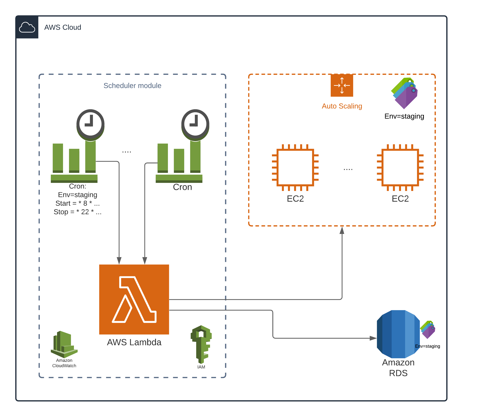

# Terraform Module AWS start_stop_scheduler

## General information

This module helps you shutdown AWS resources you don't use at night or during weekends to keep both your $ and CO² bills low!

It uses a *lambda* function and a few *cronjobs* to trigger a *start* or *stop* function at a given hour, on a subset of your AWS resources, selected by a *tag*.

It supports :
- **AutoscalingGroups**: it suspends the ASG and terminates its instances. At the start, it resumes the ASG, which launches new instances by itself.
- ~~RDS~~: soon
- ~~EC2 instances~~: maybe

The lambda function is _idempotent_, so you can launch it on an already stopped/started resource without any risks! It simplifies your job when planning with crons.



### About cronjobs

If you don't know much about crons, check <https://cron.help/>.

:warning: Beware, the AWS syntax is a bit special, check [their documentation](https://docs.aws.amazon.com/eventbridge/latest/userguide/eb-schedule-expressions.html#eb-cron-expressions) :
- It adds a 6th character for the year.
- You cannot set '*' for both Day-of-week and Day-of-month

:alarm-clock: All the cronjobs expressions are in UTC time ! Check your current timezone and do the maths.

## Compatibility

This module is meant for use with Terraform >= 0.13 and `aws` provider >= 2.

## Usage

This module can be installed using Padok's registry.

For example, if you want to shutdown during nights and weekends all staging resources :
- each night at 18:00 UTC (20:00 for France), stop resources with tag `Env=staging`
- each morning at 6:00 UTC (8:00 for France), stop resources with tag `Env=staging`


```hcl
module "aws_start_stop_scheduler" {
  source = "terraform-registry.playground.padok.cloud/incubator/start_stop_scheduler/aws"
  version = "v0.3.0"

  name = "start_stop_scheduler"
  schedules = [{
    tag = { key = "Env", value = "staging" },
    starts = {
      each_weekday_at_6 = "0 6 ? * MON-FRI *"
    },
    stops = {
      each_weekday_at_18 = "0 18 ? * MON-FRI *"
    }
  }]
}
```

_You can provide a list of schedule (each targeting a tag) and you can specify several start and stop crons for each tag._. For example, here a valid conf :

```hcl
  schedules = [{
    tag = { key = "Env", value = "staging" },
    starts = {
      each_weekday_at_6 = "0 6 ? * MON-FRI *"
    },
    stops = {
      each_weekday_at_18 = "0 18 ? * MON-FRI *"
      # Nobody works friday afternoon
      # The lambda is idempotent, you can have redundant crons
      each_friday_at_14 = "0 14 ? * FRI *"
    }
  },
  {
    tag = { key = "Env", value = "sandbox },
    # at 0, 3, 6, 9 AM etc...
    starts = {}
    stops = {
      each_day_every_3_hours = "0 */3 * * ? *"
    }
  }
  ]
}
```

You can check at [`examples/asg`](./examples/asg) for a complete example with AutoScalingGroups.

You can also test the deployed lambda function with arbitrary arguments :

```bash
aws lambda invoke --function-name <function_name_from_output> --payload '{"action": "start", "tag": {"key": "Env", "value": "staging"}}' --cli-binary-format raw-in-base64-out out.txt
```

<!-- BEGIN_TF_DOCS -->

## Providers

| Name | Version |
|------|---------|
| <a name="provider_archive"></a> [archive](#provider\_archive) | >= 2 |
| <a name="provider_aws"></a> [aws](#provider\_aws) | >= 3 |

## Inputs

| Name | Description | Type | Default | Required |
|------|-------------|------|---------|:--------:|
| <a name="input_name"></a> [name](#input\_name) | A name used to create resources in module | `string` | n/a | yes |
| <a name="input_schedules"></a> [schedules](#input\_schedules) | The configuration of your crons. Select your resources with tags, and specify several crons for start and stop. | `list(map(map(string)))` | n/a | yes |
| <a name="input_asg_schedule"></a> [asg\_schedule](#input\_asg\_schedule) | Run the scheduler on AutoScalingGroup. | `bool` | `true` | no |
| <a name="input_aws_regions"></a> [aws\_regions](#input\_aws\_regions) | List of AWS region where the scheduler will be applied. By default target the current region. | `list(string)` | `null` | no |
| <a name="input_custom_iam_lambda_role_arn"></a> [custom\_iam\_lambda\_role\_arn](#input\_custom\_iam\_lambda\_role\_arn) | Custom role used for the lambda. Useful if you cannot create IAM ressource directly with your AWS profile, or to share a role between several resources. | `string` | `null` | no |
| <a name="input_lambda_timeout"></a> [lambda\_timeout](#input\_lambda\_timeout) | Amount of time your Lambda Function has to run in seconds. | `number` | `10` | no |
| <a name="input_rds_schedule"></a> [rds\_schedule](#input\_rds\_schedule) | Run the scheduler on RDS. | `bool` | `true` | no |
| <a name="input_tags"></a> [tags](#input\_tags) | Custom Resource tags | `map(string)` | `{}` | no |

## Outputs

| Name | Description |
|------|-------------|
| <a name="output_clouwatch_event_rules"></a> [clouwatch\_event\_rules](#output\_clouwatch\_event\_rules) | Cloudwatch event rules generated by the module to trigger the lambda |
| <a name="output_lambda_function_arn"></a> [lambda\_function\_arn](#output\_lambda\_function\_arn) | The ARN of the Lambda function |
| <a name="output_lambda_function_invoke_arn"></a> [lambda\_function\_invoke\_arn](#output\_lambda\_function\_invoke\_arn) | The ARN to be used for invoking Lambda function from API Gateway |
| <a name="output_lambda_function_last_modified"></a> [lambda\_function\_last\_modified](#output\_lambda\_function\_last\_modified) | The date Lambda function was last modified |
| <a name="output_lambda_function_log_group_arn"></a> [lambda\_function\_log\_group\_arn](#output\_lambda\_function\_log\_group\_arn) | The ARN of the lambda's log group |
| <a name="output_lambda_function_log_group_name"></a> [lambda\_function\_log\_group\_name](#output\_lambda\_function\_log\_group\_name) | The name of the lambda's log group |
| <a name="output_lambda_function_name"></a> [lambda\_function\_name](#output\_lambda\_function\_name) | The name of the Lambda function |
| <a name="output_lambda_function_version"></a> [lambda\_function\_version](#output\_lambda\_function\_version) | Latest published version of your Lambda function |
| <a name="output_lambda_iam_role_arn"></a> [lambda\_iam\_role\_arn](#output\_lambda\_iam\_role\_arn) | The ARN of the IAM role used by Lambda function |
| <a name="output_lambda_iam_role_name"></a> [lambda\_iam\_role\_name](#output\_lambda\_iam\_role\_name) | The name of the IAM role used by Lambda function |

<!-- END_TF_DOCS -->
## Contributing

Refer to the [contribution guidelines](./CONTRIBUTING.md) for
information on contributing to this module.

__Please open GitLab issues for any problems encoutered when using the module, or suggestions !__

You can find the initial draft document [here](https://www.notion.so/m33/Extinction-des-machines-hors-prod-la-nuit-et-weekend-20398489023d4fa9ba847b84efe44d79).

### Requirements

* [terraform-docs](https://github.com/terraform-docs/terraform-docs)
* [pre-commit](https://pre-commit.com/)

### File structure

The project has the following folders and files:

- /: root folder
- /examples: examples for using this module
- /scripts: Scripts for specific tasks on module (see Infrastructure section on this file)
- /test: Folders with files for testing the module (see Testing section on this file)
- /helpers: Optional helper scripts for ease of use
- /main.tf: main file for this module, contains all the resources to create
- /variables.tf: all the variables for the module
- /output.tf: the outputs of the module
- /README.md: this file
